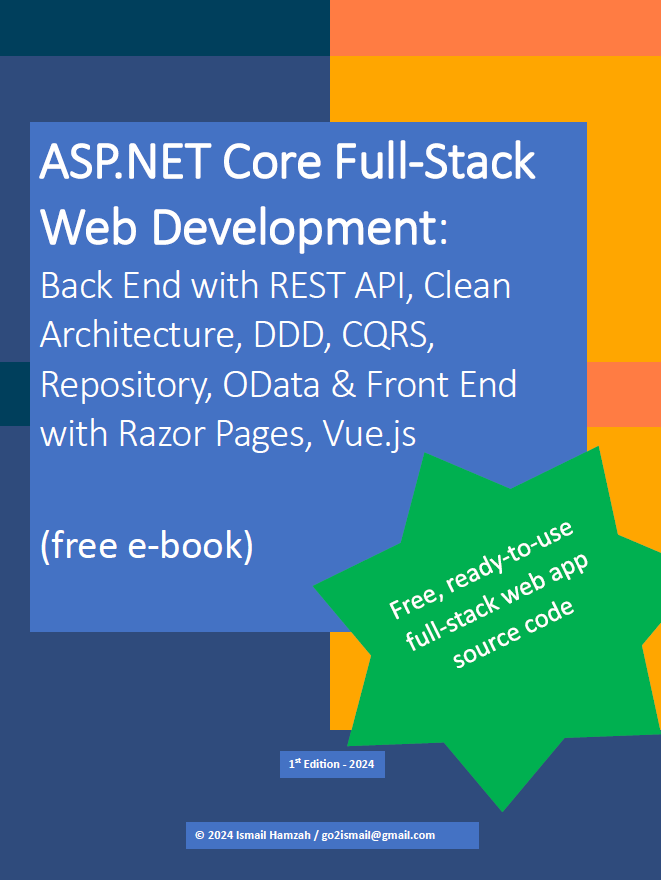

# ASP.NET Core Full-Stack Web Development: Back End with REST API, Clean Architecture, DDD, CQRS, Repository, OData & Front End with Razor Pages, Vue.js

Welcome to the accompanying source code for the book **"ASP.NET Core Full-Stack Web Development"**. This project serves as a practical guide to implement the full-stack development concepts discussed in the book. Below is an overview of the two major sections covered in this repository:

### 1. Back End
The Back End is built using ASP.NET Core to develop a REST API, focusing on clean architecture principles. It leverages **Domain-Driven Design (DDD)** to model business logic and ensure each domain stays within its bounded context. 

The architecture follows **CQRS (Command Query Responsibility Segregation)**, where commands and queries are split into two distinct layers:
- **Commands**: Operations that modify the state, following the repository pattern and adhering to DDD context.
- **Queries**: Operations to fetch data, using OData for filtering, paging, and sorting, and direct database-friendly contexts for better performance on read-heavy operations.

By employing **OData** and **dynamic LINQ**, the Back End supports flexible querying, making it an ideal setup for modern web applications.

### 2. Front End
The Front End is developed with **ASP.NET Core Razor Pages** and integrated with **Vue.js** to enhance user interfaces. Vue is used without a build system, which keeps the setup lightweight and simple while still providing the powerful reactivity features Vue.js is known for. It effectively replaces jQuery for dynamic UI behavior, offering a modern, reactive approach to handling client-side interactions. 

### Key Technologies Used:
- **ASP.NET Core** for the REST API and Razor Pages.
- **Clean Architecture** principles for maintainable code.
- **Domain-Driven Design (DDD)** for structuring the business domain.
- **CQRS** to segregate commands and queries.
- **OData** for flexible querying with paging, filtering, and sorting.
- **Vue.js** for reactive, dynamic user interfaces.

---

## Thank You
Thank you for your interest in this project and the book! Your support is greatly appreciated. If you find this repository helpful, please consider giving it a ⭐️ on GitHub. This will help the project grow and reach more developers like you!

## Download the Book
You can download the book in PDF format for free:

[Download ASP.NET Core Full-Stack Web Development PDF](ASPNET-FullStack-Development-Back-End-Front-End.pdf)

## License
This project is open source and available under the [MIT License](LICENSE).

## Need Production-Ready Codebase?

[Get the Source Code and Book Now](https://store.indotalent.com/collections/featured-product/products/inventory-wms-full-stack-edition)
